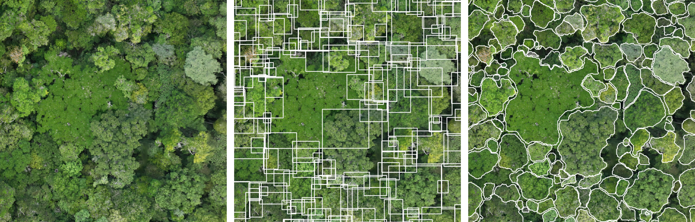

<h1 align="center">CanopyRS🌴</h1>

<p align="center">
<br/>

[//]: # (  <a href="https://github.com/hugobaudchon/CanopyRS/actions">)
[//]: # (    )
[//]: # (  </a>)
  
  
  
  
  
  <a href="https://arxiv.org/abs/2507.00170">
    
  </a>
</p>

Canopy RS (Remote Sensing) is a pipeline designed for processing high-resolution geospatial orthomosaics to detect, segment, and (in the future) classify trees of various forest biomes. It supports state-of-the-art model architectures spanning both CNNs (Faster R-CNN, Mask R-CNN, RetinaNet) and transformers (DINO, Mask2Former, SAM 2, SAM 3).
The pipeline includes components for tiling, detecting, aggregating, and segmenting trees in orthomosaics. These components can be chained together based on the desired application.

## 🎉 News
- **[2024-11-15]**: 🥇 Our team Limelight Rainforest won the $10M XPRIZE Rainforest competition, in part thanks to CanopyRS and SelvaBox!


## 🛠️ Installation

### Requirements

- Linux system (this repository was developed and tested on Ubuntu 22.04).
- Cuda version 12.6. You can install Cuda by following the [NVIDIA Cuda installation guide](https://docs.nvidia.com/cuda/cuda-installation-guide-linux/index.html). The command `nvcc --version` should then show version 12.6.

### Setup

Clone the repository to your local machine:

```bash
git clone https://github.com/hugobaudchon/CanopyRS.git
cd CanopyRS
```

Install the required Python packages in a python 3.10 conda environment:

```bash
conda create -n canopyrs -c conda-forge python=3.10 mamba
conda activate canopyrs
mamba install gdal=3.6.2 -c conda-forge
pip install torch==2.7.1 torchvision==0.22.1 --index-url https://download.pytorch.org/whl/cu126
git submodule update --init --recursive
python -m pip install -e .
python -m pip install --no-build-isolation -e ./detrex/detectron2 -e ./detrex
```

⚠️ You will likely encounter this error: `sam2 0.4.1 requires iopath>=0.1.10, but you have iopath 0.1.9 which is incompatible`, which is a conflict between Detectron2 and SAM2 libraries, but it can be ignored and shouldn't impact installation or usage of the pipeline.

## ⚙️ Configuration

Each component is configurable via YAML configuration files.

While default configuration files are provided in the `canopyrs/config` directory,
you can also create your own configuration files by creating a new folder under `canopyrs/config/`, adding a `pipeline.yaml` script,
and setup your desired list of component configuration files.

A `pipeline` is made of multiple components, each with its own configuration. A typical `pipeline.yaml` configuration will look like this:

```yaml
components_configs:
  - tilerizer:
      tile_type: tile
      tile_size: 1777
      tile_overlap: 0.75
      ground_resolution: 0.045
  - detector: default_components/detector_multi_NQOS_best
  - aggregator:
      nms_algorithm: 'iou'
      score_threshold: 0.5
      nms_threshold: 0.7
      edge_band_buffer_percentage: 0.05
```

where `tilerizer`, `detector`, and `aggregator` are the names of the components, and `default_components/detector_multi_NQOS_best` points to a `[config_subfolder_name]/[component_name]` .yaml config in `canopyrs/config/`.


### Default configs
We provide different default config files depending on your GPU resources. You can find these config files in the `config/` folder—feel free to copy & adapt them to optimize inference on your data.

| Task                       | Config name                              | Description                                                                                                                                                                                                                              |
|----------------------------|------------------------------------------|------------------------------------------------------------------------------------------------------------------------------------------------------------------------------------------------------------------------------------------|
| Detection (Instance)       | `default_detection_multi_NQOS_best`      | The best model from our paper, a DINO + Swin L-384 trained on a mixture of multi-resolution datasets including SelvaBox. NMS hyper-parameters found using the $RF1_{75}$ metric. Best quality, and memory footprint is at about 10 GB.   |
| Detection (Instance)       | `default_detection_single_S_medium`      | A single resolution (6 cm/px) DINO + ResNet-50 model. Medium quality but faster and much lower memory footprint compared to models with Swin L-384 backbones.                                                                            |
| Detection (Instance)       | `default_detection_single_S_low`         | A single resolution (10 cm/px) Faster R-CNN + ResNet-50 model. Worse quality, but even faster and even lower memory footprint.                                                                                                           |
| Segmentation (Instance)    | `default_segmentation_multi_NQOS_best`   | Same as `default_detection_multi_NQOS_best`, but with SAM2 chained after the detection model to provide instance segmentations. Best quality, and memory footprint is at about 10 GB.                                                    |
| Segmentation (Instance)    | `default_segmentation_multi_NQOS_best_S` | **(Recommended)** Same as `default_segmentation_multi_NQOS_best`, but inference is optimized for smaller trees (up to ~15m), by using a lower score threshold before NMS, and tiles with smaller spatial extent and higher GSD (4cm/px). |
| Segmentation (Instance)    | `default_segmentation_multi_NQOS_best_L` | **(Recommended)** Same as `default_segmentation_multi_NQOS_best`, but inference is optimized for larger trees (up to ~60m), by using a lower score threshold before NMS, and tiles with larger spatial extent and lower GSD (7cm/px).                      |

## 🚀 Inference

The main entry point of the inference pipeline is `infer.py`. 
This script accepts command-line arguments specifying the config to use and the input and output paths:

```bash
python infer.py -c <CONFIG_NAME> -i <INPUT_PATH> -o <OUTPUT_PATH>
```
Example run for a single raster/orthomosaic (`-i`) with a default config:
```bash
python infer.py -c default_detection_multi_NQOS_best -i /path/to/raster.tif -o <OUTPUT_PATH>
```

Example run for a folder of geo-referenced .tif images (`-t`) with a default config:
```bash
python infer.py -c default_detection_multi_NQOS_best -t /path/to/tiles/folder -o <OUTPUT_PATH>
```

## 🌳 Data

In order to train or benchmark models, you will need data. In addition to SelvaBox, we provide 5 other pre-processed datasets:

- **SelvaBox** (~31.5 GB): https://huggingface.co/datasets/CanopyRS/SelvaBox
- **SelvaMask** (~3.3 GB): https://huggingface.co/datasets/CanopyRS/SelvaMask
- **Detectree2** (~1.5 GB): https://huggingface.co/datasets/CanopyRS/Detectree2
- **NeonTreeEvaluation** (~3.3 GB): https://huggingface.co/datasets/CanopyRS/NeonTreeEvaluation
- **OAM-TCD** (~32.2 GB): https://huggingface.co/datasets/CanopyRS/OAM-TCD
- **BCI50ha** (~27.0 GB): https://huggingface.co/datasets/CanopyRS/BCI50ha
- **QuebecTrees** (~6.0 GB): https://huggingface.co/datasets/CanopyRS/QuebecTrees

To download and extract datasets automatically and use it with our benchmark or training scripts, we provide a tool.

For example, to download SelvaBox and Detectree2 datasets, you can use the following command:

```bash
python -m canopyrs.tools.detection.download_datasets \
  -d SelvaBox Detectree2 \
  -o <DATA_ROOT>
```

After extraction, they will be in COCO format (the same as geodataset's tilerizers output).

Your `<DATA_ROOT>` folder will contain one or more 'locations' folders, each containing individual 'rasters' folders, themsevles containing .json COCO annotations and tiles for minimum one fold (train, valid, test...).

For our SelvaBox and Detectree2 datasets example, the structure should look like this:

```
<DATA_ROOT>
├── brazil_zf2                         (-> Brazil location of SelvaBox)
│   ├── 20240130_zf2quad_m3m_rgb       (-> one of the Brazil location rasters for SelvaBox)
│   │   ├── tiles/
│   │   │  ├── valid/
│   │   │  │  ├── 20240130_zf2quad_m3m_rgb_tile_valid_1777_gr0p045_0_6216.tif
│   │   │  │  ├── ...
│   │   ├──  20240130_zf2quad_m3m_rgb_coco_gr0p045_valid.json
│   │   └──  ...
│   ├── 20240130_zf2tower_m3m_rgb
│   ├── 20240130_zf2transectew_m3m_rgb
│   └── 20240131_zf2campirana_m3m_rgb
├── ecuador_tiputini                   (-> Ecuador location of SelvaBox)
│   ├── ...
├── malaysia_detectree2                (-> Malaysia location of Detectree2)
│   ├── ...
└── panama_aguasalud                   (-> Panama location of SelvaBox)
```

Each additional dataset will add one or more locations folders.

## 📊 Evaluation

### Find optimal NMS parameters for Raster-level evaluation ($RF1_{75}$ or other IoU thresholds)
To find the optimal NMS parameters for your model, i.e. `nms_iou_threshold` and `nms_score_threshold`,
you can use the [`find_optimal_raster_nms.py`](canopyrs/tools/detection/find_optimal_raster_nms.py) tool script. This script will run a grid search over the NMS parameters and evaluate the results using the COCO evaluation metrics at a chosen IoU threshold.
Depending on how many Rasters there are in the datasets you select, it could take from a few tens of minutes to a few hours. If you have lots of CPU cores, we recommend to increase the number of workers.

Use `--eval_iou_threshold 0.75` for $RF1_{75}$ (default) or `--eval_iou_threshold 50:95` for the COCO-style sweep ($RF1_{50:95}$). Comma-separated lists (e.g., `--eval_iou_threshold 0.50,0.65,0.80`) are also accepted.

You have to pass the path of a detection model config file, compatible with CanopyRS.

For example to find NMS parameters for the `default_detection_multi_NQOS_best` default model (DINO+Swin L-384 trained on NQOS datasets) on the validation set of SelvaBox and Detectree2 datasets,
you can use the following command (make sure to download the data first, see `Data` section):

```bash
python -m canopyrs.tools.detection.find_optimal_raster_nms \
  -c config/default_detection_multi_NQOS_best/detector.yaml \
  -d SelvaBox Detectree2 \
  -r <DATA_ROOT> \
  -o <OUTPUT_PATH> \
  --n_workers 6 \
  --eval_iou_threshold 0.75
```

To search for NMS parameters optimized for the COCO-style $RF1_{50:95}$ metric instead, use:

```bash
python -m canopyrs.tools.detection.find_optimal_raster_nms \
  -c config/default_detection_multi_NQOS_best/detector.yaml \
  -d SelvaBox Detectree2 \
  -r <DATA_ROOT> \
  -o <OUTPUT_PATH> \
  --n_workers 6 \
  --eval_iou_threshold 50:95
```

For more information on parameters, you can use the `--help` flag:
```bash
python -m canopyrs.tools.detection.find_optimal_raster_nms --help
```

### Benchmarking
To benchmark a model on the test or valid sets of some datasets, you can use the [`benchmark.py`](canopyrs/tools/detection/benchmark.py) tool script.

This script will run the model and evaluate the results using tile-level COCO metrics (mAP and mAR).

To run raster-level evaluation ($RF1$) in addition to tile-level, you must pass values for `--nms_threshold` and `--score_threshold` (to find these parameter values, you can run `find_optimal_raster_nms.py` as described in the previous section). The benchmark will then run a single raster-level aggregation with those values and report RF1 at the chosen IoU setting.

The raster-level $RF1$ can be computed at a single evaluation IoU or across a sweep: use `--eval_iou_threshold 0.75` for $RF1_{75}$ (default) or `--eval_iou_threshold 50:95` for the COCO-style sweep ($RF1_{50:95}$). Comma-separated lists (e.g., `--eval_iou_threshold 0.50,0.65,0.80`) are also accepted.


⚠️ **Important:** Always use the **same** `--eval_iou_threshold` value when finding NMS parameters (previous section) and when running the final benchmark. If you optimize NMS for $RF1_{75}$ but benchmark with $RF1_{50:95}$, your NMS parameters will not be optimal for that metric.

For example, to benchmark the `default_detection_multi_NQOS_best` default model (DINO+Swin L-384 trained on NQOS datasets) on the test set of SelvaBox and Detectree2 datasets,
you can use the following command (make sure to download the data first, see `Data` section):

```bash
python -m canopyrs.tools.detection.benchmark \
  -c config/default_detection_multi_NQOS_best/detector.yaml \
  -d SelvaBox Detectree2 \
  -r <DATA_ROOT> \
  -o <OUTPUT_PATH> \
  --nms_threshold 0.7 \
  --score_threshold 0.5 \
  --eval_iou_threshold 0.75
```

By default the evaluation is done on the test set. 
For more information on parameters, you can use the `--help` flag:
```bash
python -m canopyrs.tools.detection.benchmark --help
```
## 🧠 Training

We provide a `train.py` script to train detector models on preprocessed datasets (you must download them first, see `Data`).

Currently, our training pipeline requires [wandb](https://wandb.ai/site) to be installed and configured for logging purposes.

Then, for example, if you want to train a model on the `SelvaBox` and `Detectree2` datasets, you will have to copy a `detector.yaml` config file, for example from [`config/default_detection_multi_NQOS_best`](canopyrs/config/default_detection_multi_NQOS_best/detector.yaml), and modify a few things:
- `model`: the model type, either `dino_detrex` for detrex-based DINO models or `faster_rcnn_detectron2` for detectron2-based Faster R-CNN models.
- `architecture`: the model architecture, either `dino-swin/dino_swin_large_384_5scale_36ep.py`, `dino-resnet/dino_r50_4scale_24ep.py` (for DINOs) or `COCO-Detection/faster_rcnn_R_50_FPN_3x.yaml` (for Faster R-CNNs) are currently supported.
- `checkpoint_path`: path to the pretrained model checkpoint. You can keep the pretrained checkpoint we provide in order to fine tune it, or replace it with one of [detrex](https://detrex.readthedocs.io/en/latest/tutorials/Model_Zoo.html) COCO checkpoints.
- `data_root_path`: path to your dataset root folder (where the `SelvaBox` and `Detectree2` extracted datasets are, i.e. the <DATA_ROOT> folder in the `Data` section).
- `train_output_path`: path to the output folder where the model checkpoints and logs will be saved.
- `wandb_project`: name of the wandb project to log to (make sure to be [logged](https://wandb.ai/site)).
- `train_dataset_names`: A list of the names of the `location` folders (children of `data_root_path` you defined above) you want to train on. For example, `SelvaBox` has three locations, `brazil_zf2`, `ecuador_tiputini`, and `panama_aguasalud`. You can choose to train on all of them, or only on one or two of them. The same goes for `Detectree2` which has only one location, `malaysia_detectree2`.
- `valid_dataset_names`: A list of the names of the `location` folders (children of `data_root_path` you defined above) you want to validate on (see above for locations).

You can also modify plenty of other parameters such as `batch_size`, `lr`...

Finally, you can run the training script with the following command:

```bash
python train.py \
  -m detector \
  -c config/default_detection_multi_NQOS_best/detector.yaml 
```

[//]: # (citation section)
## 📚 Citation
If you use CanopyRS or SelvaBox in your research, please cite our paper (arXiv preprint):

```bibtex
@misc{baudchon2025selvaboxhighresolutiondatasettropical,
      title={SelvaBox: A high-resolution dataset for tropical tree crown detection}, 
      author={Hugo Baudchon and Arthur Ouaknine and Martin Weiss and Mélisande Teng and Thomas R. Walla and Antoine Caron-Guay and Christopher Pal and Etienne Laliberté},
      year={2025},
      eprint={2507.00170},
      archivePrefix={arXiv},
      primaryClass={cs.CV},
      url={https://arxiv.org/abs/2507.00170}, 
}
```

If you use other datasets that we have preprocessed, please also cite the original authors of those datasets directly.
