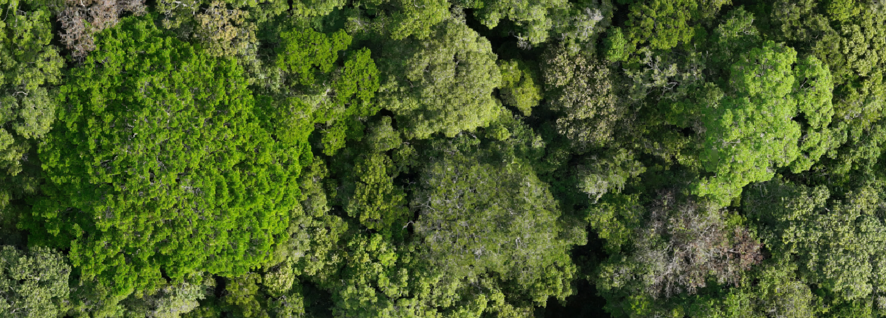

<h1 align="center">CanopyRS</h1>



Canopy Remote Sensing is a pipeline designed for processing geospatial orthomosaics to detect, segment, and (in the future) classify trees.
The pipeline includes components for tiling, detecting, aggregating, and segmenting rasters. These components can be chained together based on the desired application.

## Installation

Clone the repository to your local machine:

```bash
git clone https://github.com/hugobaudchon/CanopyRS.git
cd CanopyRS
```

Install the required Python packages:

#### Linux
```bash
conda create -n canopyrs python=3.10
conda activate canopyrs
conda install -c conda-forge gdal=3.6.2
pip install -r requirements.txt
pip install git+https://github.com/facebookresearch/detectron2.git@70f4543
pip install git+https://github.com/IDEA-Research/detrex.git
```

[//]: # ()
[//]: # (#### Windows)

[//]: # (Coming soon)

## Configuration

Each component is configurable via YAML configuration files.

While default configuration files are provided in the `config` directory,
you can also create your own configuration files by creating a new folder under `config/`, adding a `pipeline.yaml` script,
and setup your desired list of component configuration files.

A `pipeline` is made of multiple components, each with its own configuration file. A typical `pipeline.yaml` configuration will look like this:

```yaml
components_configs:
  - tilerizer: default_detection_multi_NQOS_best/tilerizer
  - detector: default_detection_multi_NQOS_best/detector
  - aggregator: default_detection_multi_NQOS_best/aggregator
```

where `tilerizer`, `detector`, and `aggregator` are the names of the components, and `default_detection_multi_NQOS_best/tilerizer` points to a `[config_name]/[component_name]` component.

We provide different default config files depending on your GPU resources:

| Config name                            | Description                                                                                                                                                                      |
|----------------------------------------|----------------------------------------------------------------------------------------------------------------------------------------------------------------------------------|
| `default_detection_multi_NQOS_best`    | The best model from our paper, a DINO + Swin L-384 trained on a mixture of multi-resolution datasets including SelvaBox. Best quality, and memory footprint is at about 10 GB. |
| `default_segmentation_multi_NQOS_best` | Same as `default_detection_multi_NQOS_best`, but with SAM2 chained after the detection model to provide instance segmentations. Best quality, and memory footprint is at about 10 GB.           |
| `default_detection_single_S_medium`    | A single resolution (6 cm/px) DINO + ResNet-50 model. Medium quality but faster and much lower memory footprint compared to models with Swin L-384 backbones.                    |
| `default_detection_single_S_low`       | A single resolution (10 cm/px) Faster R-CNN + ResNet-50 model. Worse quality, but even faster and even lower memory footprint.                                                   |


## Inference

The main entry point of the inference pipeline is `infer.py`. 
This script accepts command-line arguments specifying the config to use and the input and output paths:

```bash
python infer.py -c <CONFIG_NAME> -i <INPUT_PATH> -o <OUTPUT_PATH>
```
Example run for a single raster/orthomosaic (`-i`) with our default config:
```bash
python infer.py -c default_detection_multi_NQOS_best -i /path/to/raster.tif -o <OUTPUT_PATH>
```

Example run for a folder of tiles/images (`-t`) with our default config:
```bash
python infer.py -c default_detection_multi_NQOS_best -t /path/to/tiles/folder -o <OUTPUT_PATH>
```

## Data

In order to train or benchmark models, you will need data. In addition to SelvaBox, we provide 5 other pre-processed datasets:

- **SelvaBox** (~31.5 GB): https://huggingface.co/datasets/CanopyRS/SelvaBox
- **Detectree2** (~1.5 GB): https://huggingface.co/datasets/CanopyRS/Detectree2
- **NeonTreeEvaluation** (~3.3 GB): https://huggingface.co/datasets/CanopyRS/NeonTreeEvaluation
- **OAM-TCD** (~32.2 GB): https://huggingface.co/datasets/CanopyRS/OAM-TCD
- **BCI50ha** (~27.0 GB): https://huggingface.co/datasets/CanopyRS/BCI50ha
- **QuebecTrees** (~6.0 GB): https://huggingface.co/datasets/CanopyRS/QuebecTrees

To download and extract datasets automatically and use it with our benchmark or training scripts, we provide a tool.

For example, to download SelvaBox and Detectree2 datasets, you can use the following command:

```bash
python -m tools.detection.download_datasets \
  -d SelvaBox Detectree2 \
  -o <DATA_ROOT>
```

After extraction, they will be in COCO format (the same as geodataset's tilerizers output).

Your `<DATA_ROOT>` folder will contain one or more 'locations' folders, each containing individual 'rasters' folders, themsevles containing .json COCO annotations and tiles for minimum one fold (train, valid, test...).

For our SelvaBox and Detectree2 datasets example, the structure should look like this:

```
<DATA_ROOT>
├── brazil_zf2                         (-> Brazil location of SelvaBox)
│   ├── 20240130_zf2quad_m3m_rgb       (-> one of the Brazil location rasters for SelvaBox)
│   │   ├── tiles/
│   │   │  ├── valid/
│   │   │  │  ├── 20240130_zf2quad_m3m_rgb_tile_valid_1777_gr0p045_0_6216.tif
│   │   │  │  ├── ...
│   │   ├──  20240130_zf2quad_m3m_rgb_coco_gr0p045_valid.json
│   │   └──  ...
│   ├── 20240130_zf2tower_m3m_rgb
│   ├── 20240130_zf2transectew_m3m_rgb
│   └── 20240131_zf2campirana_m3m_rgb
├── ecuador_tiputini                   (-> Ecuador location of SelvaBox)
│   ├── ...
├── malaysia_detectree2                (-> Malaysia location of Detectree2)
│   ├── ...
└── panama_aguasalud                   (-> Panama location of SelvaBox)
```

Each additional dataset will add one or more locations folders.

## Evaluation

### Find optimal NMS parameters for Raster-level evaluation ($RF1_{75}$)
To find the optimal NMS parameters for your model, i.e. `nms_iou_threshold` and `nms_score_threshold`,
you can use the [`find_optimal_raster_nms.py`](tools/detection/find_optimal_raster_nms.py) tool script. This script will run a grid search over the NMS parameters and evaluate the results using the COCO evaluation metrics.
Depending on how many Rasters there are in the datasets you select, it could take from a few tens of minutes to a few hours. If you have lots of CPU cores, we recommend to increase the number of workers.

You have to pass the path of a detection model config file, compatible with CanopyRS.

For example to find NMS parameters for the `default_detection_multi_NQOS_best` default model (DINO+Swin L-384 trained on NQOS datasets) on the validation set of SelvaBox and Detectree2 datasets,
you can use the following command (make sure to download the data first, see `Data` section):

```bash
python -m tools.detection.find_optimal_raster_nms \
  -c config/default_detection_multi_NQOS_best/detector.yaml \
  -d SelvaBox Detectree2 \
  -r <DATA_ROOT> \
  -o <OUTPUT_PATH> \
  --n_workers 6
```

For more information on parameters, you can use the `--help` flag:
```bash
python -m tools.detection.find_optimal_raster_nms --help
```

### Benchmarking
To benchmark a model on the test or valid sets of some datasets, you can use the [`benchmark.py`](tools/detection/benchmark.py) tool script.

This script will run the model and evaluate the results using COCO metrics (mAP and mAR).

If you provide `nms_threshold` and `score_threshold` parameters, it will also compute the $RF1_{75}$ metric by running an NMS at the raster level for datasets that have raster-level annotations.

For example, to benchmark the `default_detection_multi_NQOS_best` default model (DINO+Swin L-384 trained on NQOS datasets) on the test set of SelvaBox and Detectree2 datasets,
you can use the following command (make sure to download the data first, see `Data` section):

```bash
python -m tools.detection.benchmark \
  -c config/default_detection_multi_NQOS_best/detector.yaml \
  -d SelvaBox Detectree2 \
  -r <DATA_ROOT> \
  -o <OUTPUT_PATH> \
  --nms_threshold 0.7 \
  --score_threshold 0.5
```

By default the evaluation is done on the test set. 
For more information on parameters, you can use the `--help` flag:
```bash
python -m tools.detection.benchmark --help
```
## Training

We provide a `train.py` script to train detector models on preprocessed datasets (you must download them first, see `Data`).

Currently, our training pipeline requires [wandb](https://wandb.ai/site) to be installed and configured for logging purposes.

Then, for example, if you want to train a model on the `SelvaBox` and `Detectree2` datasets, you will have to copy a `detector.yaml` config file, for example from [`config/default_detection_multi_NQOS_best`](config/default_detection_multi_NQOS_best/detector.yaml), and modify a few things:
- `model`: the model type, either `dino_detrex` for detrex-based DINO models or `faster_rcnn_detectron2` for detectron2-based Faster R-CNN models.
- `architecture`: the model architecture, either `dino-swin/dino_swin_large_384_5scale_36ep.py`, `dino-resnet/dino_r50_4scale_24ep.py` (for DINOs) or `COCO-Detection/faster_rcnn_R_50_FPN_3x.yaml` (for Faster R-CNNs) are currently supported.
- `checkpoint_path`: path to the pretrained model checkpoint. You can keep the pretrained checkpoint we provide in order to fine tune it, or replace it with one of [detrex](https://detrex.readthedocs.io/en/latest/tutorials/Model_Zoo.html) COCO checkpoints.
- `data_root_path`: path to your dataset root folder (where the `SelvaBox` and `Detectree2` extracted datasets are, i.e. the <DATA_ROOT> folder in the `Data` section).
- `train_output_path`: path to the output folder where the model checkpoints and logs will be saved.
- `wandb_project`: name of the wandb project to log to (make sure to be [logged](https://wandb.ai/site)).
- `train_dataset_names`: A list of the names of the `location` folders (children of `data_root_path` you defined above) you want to train on. For example, `SelvaBox` has three locations, `brazil_zf2`, `ecuador_tiputini`, and `panama_aguasalud`. You can choose to train on all of them, or only on one or two of them. The same goes for `Detectree2` which has only one location, `malaysia_detectree2`.
- `valid_dataset_names`: A list of the names of the `location` folders (children of `data_root_path` you defined above) you want to validate on (see above for locations).

You can also modify plenty of other parameters such as `batch_size`, `lr`...

Then you can then run the training script with the following command:

```bash
python train.py \
  -m detector \
  -c config/default_detection_multi_NQOS_best/detector.yaml 
```


